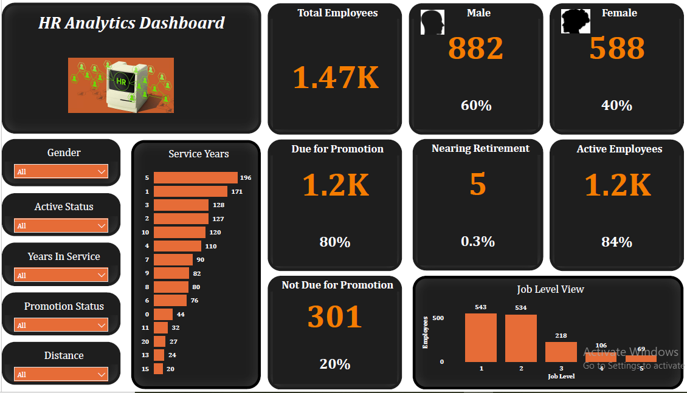

## Employee Performance Analysis
A dashboard for the analysis of employee performance in the HR department
An view of the dashboard which was designed to answer the key business questions.

The dashboard was designed to answer the following questions:
- How many employees are there in the company in total?
- What is the gender distribution of the employees?
- How many employees are due or not due for promotion?
- How many employees are nearing retirement?
- What is the distribution of employees by years of service?
- How many employees are currently active?
- How are employees distributed by job level or proximity to the office?

### How to run the project

#### Ensure to open the PowerBI software.
#### Import the project file which is in .pbix format.
#### Dataset: https://www.kaggle.com/datasets/pavansubhasht/ibm-hr-analytics-attrition-dataset